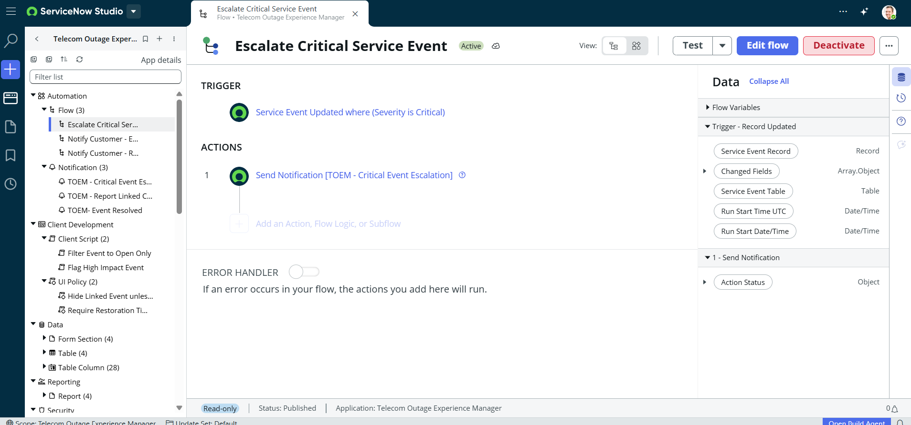

# Flow: Escalate Critical Service Event

**Status:** Active
**Application:** Telecom Outage Experience Manager

## Trigger
- Service Event Updated where (Severity is Critical)

## Actions
1. **Send Notification** — `[TOEM - Critical Event Escalation]`

## Data Used
- Service Event Record (Record)
- Changed Fields (Array.Object)
- Service Event Table (Table)
- Run Start Time UTC (Date/Time)
- Run Start Date/Time (Date/Time)

## Error Handler
- Off (no custom error-handling actions configured)

