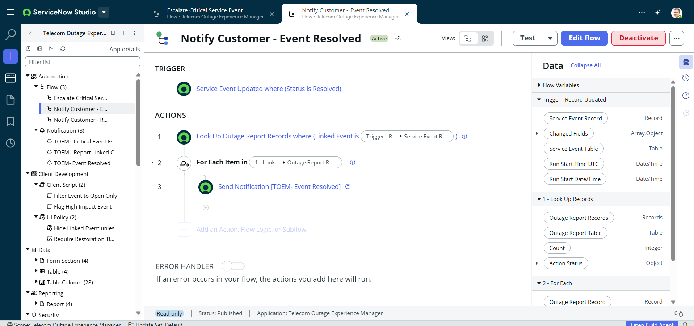

# Flow: Notify Customer - Event Resolved

**Status:** Active
**Application:** Telecom Outage Experience Manager

## Trigger
- Service Event Updated where (Status is Resolved)

## Actions
1. **Look Up Records** — Outage Report Records where (Linked Event is Trigger → Service Event Record)
2. **For Each Item in** — (1) Look Up → Outage Report Records
3. **Send Notification** — `[TOEM - Event Resolved]`

## Data Used
- Service Event Record (Record)
- Changed Fields (Array.Object)
- Service Event Table (Table)
- Run Start Time UTC / Run Start Date/Time (Date/Time)
- Outage Report Records (Records), Outage Report Table (Table), Count (Integer)
- Outage Report Record (per iteration, Record)

## Error Handler
- Off (no custom error-handling actions configured)

