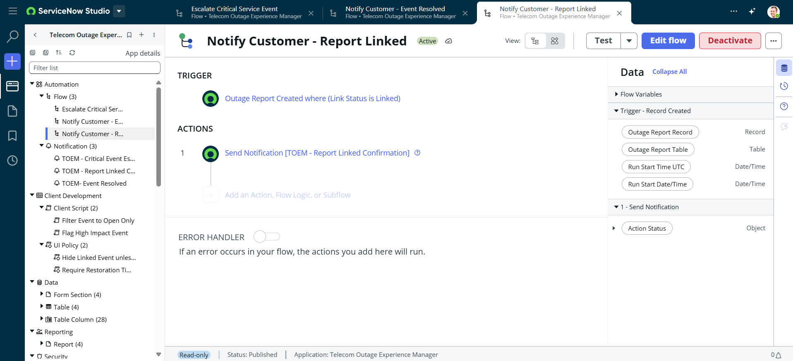

# Flow: Notify Customer - Report Linked

**Status:** Active
**Application:** Telecom Outage Experience Manager

## Trigger
- Outage Report Created where (Link Status is Linked)

## Actions
1. **Send Notification** — `[TOEM - Report Linked Confirmation]`

## Data Used
- Outage Report Record (Record)
- Outage Report Table (Table)
- Run Start Time UTC / Run Start Date/Time (Date/Time)

## Error Handler
- Off (no custom error-handling actions configured)

