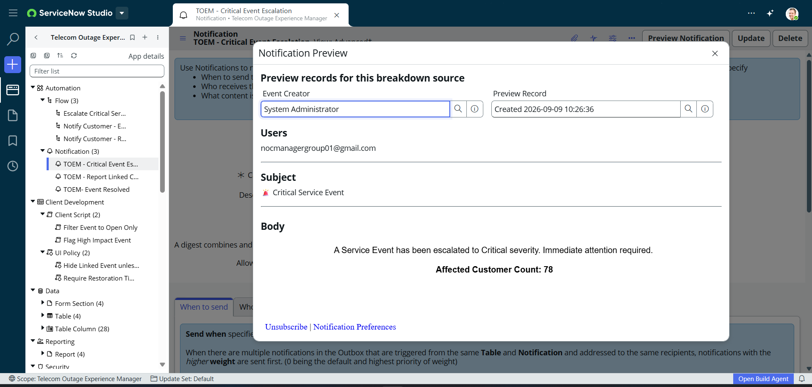

# Notification: TOEM - Critical Event Escalation

**Application:** Telecom Outage Experience Manager

## Recipients
- nocmanagergroup01@gmail.com

## Subject
🚨 Critical Service Event

## Body
A Service Event has been escalated to Critical severity. Immediate attention required.

**Affected Customer Count:** {affected_customer_count}

---
*Triggered by the "Escalate Critical Service Event" flow when a Service Event is updated with Severity = Critical.*

