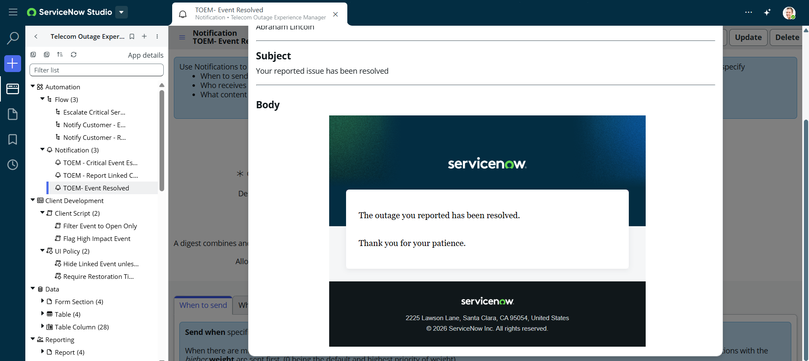

# Notification: TOEM - Event Resolved

**Application:** Telecom Outage Experience Manager

## Recipients
- Reporting customer (e.g. Abraham Lincoln)

## Subject
Your reported issue has been resolved

## Body (HTML email template)
The outage you reported has been resolved.

Thank you for your patience.

---
*Triggered by the "Notify Customer - Event Resolved" flow, sent for each linked Outage Report when the related Service Event's Status changes to Resolved.*

