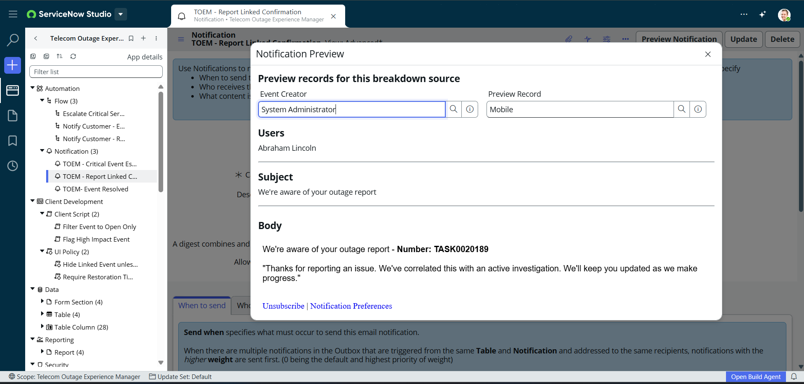

# Notification: TOEM - Report Linked Confirmation

**Application:** Telecom Outage Experience Manager

## Recipients
- Reporting customer (e.g. Abraham Lincoln)

## Subject
We're aware of your outage report

## Body
We're aware of your outage report - **Number:** {number}

"Thanks for reporting an issue. We've correlated this with an active investigation. We'll keep you updated as we make progress."

---
*Triggered by the "Notify Customer - Report Linked" flow when an Outage Report is created with Link Status = Linked.*

