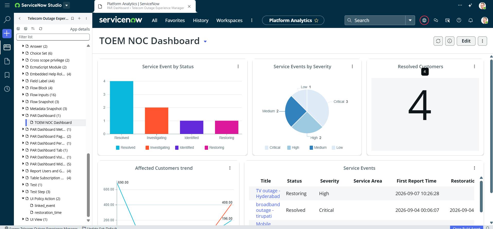

# PAR Dashboard: TOEM NOC Dashboard

**Application:** Telecom Outage Experience Manager

## Widgets
- Service Event by Status (bar chart: Resolved, Investigating, Identified, Restoring)
- Service Events by Severity (pie chart: Critical, High, Medium, Low)
- Resolved Customers (single number KPI)
- Affected Customers trend (line chart)
- Service Events (list: Title, Status, Severity, Service Area, First Report Time, Restoration Time)

